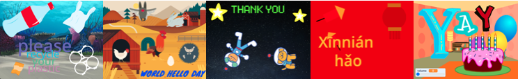

## Introduction

You will create an interactive card to send to someone to cheer them up or help them celebrate an occasion. You will decide who to make a card for and will look at cards that others have made to get ideas.

You will use the skills you have learnt in the Look After Yourself Learning Journey which included Skills projects on being kind to yourself and others. 

In the [Challenge] projects - [Looping sprites](https://learning-admin.raspberrypi.org/en/projects/looping-sprites), [Stamping app](https://learning-admin.raspberrypi.org/en/projects/stamping-app) and [Same but different](https://learning-admin.raspberrypi.org/en/projects/same-but-different) - you used your skills to create your own projects.

You now have a range of skills. In this Independent project you will choose some of those skills to use to make your very own project which is different to all other digital card projects.

### What you will make

--- no-print ---
Click anywhere to make the rocket ship fly. What happens if the rocket ship flies into the star?

  <iframe allowtransparency="true" width="485" height="402" src="https://scratch.mit.edu/projects/embed/408916353/?autostart=false" frameborder="0"></iframe>

--- /no-print ---

--- print-only ---

--- /print-only ---

--- collapse ---
---
title: What you will need
---
### Hardware

+ Describe hardware here

### Software

+ Scratch 3.0 (either [online](http://rpf.io/scratchon) or [offline](http://rpf.io/scratchoff))
+ Python 3
+ This project can be completed in a web browser using [trinket.io](https://trinket.io/)

### Downloads

+ [rpf.io/project-name-go](http://rpf.io/project-name-go){:target="_blank"}

--- /collapse ---

--- collapse ---
---
title: What you will learn
---

+ How to come up with original design ideas to create a project for someone specific
+ How to use the skills you have learned to turn your ideas into code
+ How to use the feedback of others in your development process

--- /collapse ---

--- collapse ---
---
title: Additional information for educators
---

If you need to print this project, please use the [printer-friendly version](https://projects.raspberrypi.org/en/projects/project-name/print){:target="_blank"}.

[Here is a link to the resources for this project](http://rpf.io/project-name-go).

--- /collapse ---
