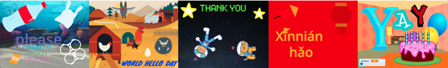

## Make 🧱 and test 🔄

Now, it's time to make your digital card. Start small, and add more to your project if you have time. 

**Tip:** Remember to test your project each time you add something. It is much easier to find and fix bugs before you make more changes.



Some useful skills you could use for your card:  
+ Add code to sprites and a backdrop
+ Customise sprites in the Paint editor
+ Add `graphic effects`{:class="block3looks"}, `motion`{:class="block3motion"}, and `sound`{:class="block3sound"} to a sprite
+ Use the `forever`{:class="block3control"} and `repeat`{:class="block3control"} loop blocks
+ Use the `next costume`{:class="block3looks"} and `wait`{:class="block3control"} blocks to animate a sprite
+ Use `layers`{:class="block3looks"} blocks to move sprites in front of or behind other sprites
+ Use the `text to speech`{:class="block3extensions"} and `translate`{:class="block3extensions"} Scratch extensions 

--- task ---

Add the backdrop and sprites. 


--- /task ---

### For each sprite 🐈 🐢 🎈

--- task ---

You will need to add code to each character and object sprite in your card. Consider whether they will do anything when the project starts, or when the sprite is clicked. 

For example:
+ "When the user clicks on the green flag, a sprite moves"
+ "When the user clicks on a sprite, the sprite changes colour"

--- collapse ---
---
title: Start code with Hat blocks
---

```blocks3
when green flag clicked
when this sprite clicked
```

These blocks have a different shape — they are sometimes called **Hat blocks**. They start code running when a particular event happens, such as a user clicking.

--- /collapse ---

```blocks3
when flag clicked

when this sprite clicked
```

[[[scratch3-change-costumes-to-show-mood]]]

[[[scratch3-animate-movement-costumes]]]

[[[scratch3-graphic-effects]]]

[[[scratch3-jiggle-a-sprite]]]

**Tip:** Some of the best ideas come from playing. You will find good ideas by accident.

--- /task ---

### Your message

--- task ---

You can add your message as either a **sprite/sprites** or a **sound**:

--- collapse ---
---

title: Use letter sprites from the Sprite Library

---

You can go to **Choose a Sprite** and select **Letters** from the Sprite Library or search for `numbers`:
{:width="300px"}

--- /collapse ---


You could use the **Text** tool in the Paint editor to write a short message: 

[[[scratch3-use-text-tool]]]

You can record a spoken message:


[[[scratch3-record-sound]]]

You can type a message for Scratch to speak:


[[[scratch3-text-to-speech]]]

--- /task ---

### Scratch editor reminders

--- task ---

[[[scratch3-copy-code]]]

[[[scratch3-full-screen]]]

[[[scratch3-duplicate-sprite]]]

--- /task ---

--- task ---

**Test:** 🔄 Show someone else your project and ask for 🗣️ their feedback. Do you want to make any changes to your card? 

⏱️ If you have time, you can upgrade your project. 

💡 You could:
- Add more code to your sprites
- Add another sprite
- Record or add a sound 
- Create a new costume in the Paint editor

If you are stuck for ideas, don't forget to look at the ['From me to you' examples](https://scratch.mit.edu/studios/27073994){:target="_blank"} or the [From me to you Community Projects](https://scratch.mit.edu/studios/28525955){:target="_blank"} and **See inside**.

If you have finished or don't have much time left, then move on to the next step to share your digital card.

--- /task ---

--- task ---

**Debugging** is finding and fixing mistakes in your code that are called **bugs** 🐞. 

You might find some bugs in your project that you need to fix. Here are some common bugs:

--- collapse ---
---

title: Debugging tips

---

+ **My sprite is going upside down** — Add a `set rotation style left-right`{:class="block3motion"} or `set rotation style don't rotate`{:class="block3motion"} block.

+ **My sprite 'jumps' when it changes costume or bounces** — Make sure that the costume is centred in the Paint editor (line up the blue cross with the cross hairs in the centre of the Paint editor).

+ **My sprite stops when it gets to the edge of the Stage** — Add an `if on edge, bounce`{:class="block3motion"} block.

+ **My sound does not play** — Have you added a block to `play sound`{:class="block3sound"} when the sprite is clicked? If you have copied code from another sprite, you will need to add the sound to this sprite from the **Sounds** tab. Check the volume on your computer and make sure that you have not lowered the volume with code — try `set volume to`{:class="block3sound"}`100`.

+ **Other sprites keep going in front of my sprite** — Use a `go to front layer`{:class="block3looks"} block.

+ **My sprite only moves/changes once** — Put your code inside a `forever`{:class="block3control"} block so it keeps running.

+ **My sprite does not change when I move a variable slider** — Put your code inside a `forever`{:class="block3control"} block so it keeps updating. 

--- /collapse ---

You might find a bug that is not listed here. Can you work out how to fix it?

🗣️ We love hearing about your bugs and how you fixed them. Use the **Send feedback** button at the bottom of this page and tell us if you found a different bug in your project.

--- /task ---

--- save ---

