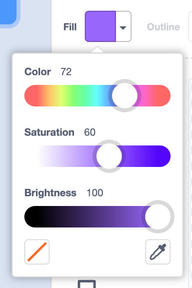
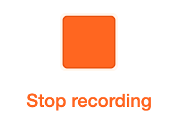

## Make 🧱 and test 🔄

Now, it's time to make your digital card. Start small, and add more to your project if you have time. 

**Tip:** Remember to test your project each time you add something. It is much easier to find and fix bugs before you make more changes.


For this project, you need to know how to:  
+ Add code to sprites and a backdrop
+ Customise sprites in the Paint editor
+ Add `graphic effects`{:class="block3looks"}, `motion`{:class="block3motion"}, and `sound`{:class="block3sound"} to a sprite
+ Use the `forever`{:class="block3control"} block
+ Use the `next costume`{:class="block3looks"} and `wait`{:class="block3control"} blocks to animate a sprite
+ Make a `variable`{:class="block3variables"}, turn it into a slider with a range, and use it as an input to a block
+ Use `layers`{:class="block3looks"} blocks to move sprites in front of or behind other sprites


--- task ---
If you have not already chosen a backdrop and added a sprite, then start now. You can always add more later, including using the Paint editor to make your own. 
--- /task ---

--- task ---

Think about **what** you want to say in your message in your digital card.

--- /task ---

--- task ---

Now, think about **how** you will say your message. You can add your message as either a **sprite/sprites** or a **sound**.

You can go to **Choose a Sprite** and select **Letters** from the Sprite Library or search for `numbers`:
{:width="300px"}

You could use the **Text** tool in the Paint editor to write a short message: 

--- collapse ---
---
title: Use the Text tool in the Paint editor
---

Click on the **Fill** colour chooser and select the first colour that you want for your text:
{:width="150px"}

Select the **Text** tool:
{:width="150px"}

Click on the Paint editor and start typing.

Click on the drop-down menu and select the font that you want:
{:width="300px"}

Click on the **Select (Arrow)** tool and select your text. Drag the corner handles to resize your text:
{:width="300px"}

Do you want to change the **Fill** colour? Select the **Fill (Bucket)** tool and hover over your text. It will automatically change colour. Click on the text to make the change:
{:width="150px"}

If you want each word in your message to be a different colour, size, and font, then follow the process above for each word in your message.

Position your text and/or group of words with the cross hairs in the centre of the Paint editor:
{:width="400px"}

To layer your words, use the **Forward** and **Backward** tools:
{:width="400px"}

--- /collapse ---

You can also use any other skill and tool in the Paint editor that you have learned about:

+ [Paint editor](https://projects.raspberrypi.org/en/projects/getting-started-scratch/9){:target="scratch_guide"}

--- /task ---

--- task ---
Do you need to add sounds to a **sprite** or to the **Stage**?

You can record a spoken message if you like:

--- collapse ---
---
title: Record a sound
---

Select the sprite that you want to add recorded sound to. Click on its **Sounds** tab, go to the menu in the bottom left-hand corner, and select **Record**:
{:width="200px"}

To start recording, click the red circle button:
{:width="200px"}

To stop recording, click the red square button:
{:width="200px"}

You can now **Re-record**, **Play** the recording, and/or **Save** your sound.

Name your sound:
{:width="300px"}

--- /collapse ---

--- /task ---

--- task ---

Now, think about how the user will interact with your project.

For example:
+ "When the user clicks on the green flag, a sprite moves"

+ "When the user clicks on a sprite, the sprite changes colour"

**Tip:** Write down your main idea or tell a friend or family member. It is easier to make a project when you can explain what your idea is.

You might have lots of other ideas. Save them for later.

--- /task ---

--- task ---
Add a block for **when** your sprite should do something.

--- collapse ---
---
title: Start code with Hat blocks
---

```blocks3
when green flag clicked
when this sprite clicked
```

These blocks have a different shape — they are sometimes called **Hat blocks**. They start code running when a particular event happens, such as a user clicking.

--- /collapse ---

--- /task ---

--- task ---

Add the blocks that you need to make your sprite do **what** you want it to do.

Choose the blocks that you need and drag them underneath a Hat block. Put blocks inside a `forever`{:class="block3control"} block if you want them to keep running.


You can use any of the skills that you have learned:

+ [Motion](https://projects.raspberrypi.org/en/projects/getting-started-scratch/5){:target="scratch_guide"}
+ [Looks](https://projects.raspberrypi.org/en/projects/getting-started-scratch/6){:target="scratch_guide"}
+ [Sound](https://projects.raspberrypi.org/en/projects/getting-started-scratch/7){:target="scratch_guide"}
+ [Variables](https://projects.raspberrypi.org/en/projects/getting-started-scratch/8){:target="scratch_guide"}

--- /task ---

**Tip:** Some of the best ideas come from playing. You will find good ideas by accident.

--- task ---
Test your new code. Is it running as you imagined? 

**Debugging** is finding and fixing mistakes in your code that are called **bugs**.

--- collapse ---
---

title: Debugging tips

---

+ **My sprite is going upside down** — Add a `set rotation style left-right`{:class="block3motion"} or `set rotation style don't rotate`{:class="block3motion"} block.

+ **My sprite 'jumps' when it changes costume or bounces** — Make sure that the costume is centred in the Paint editor (line up the blue cross with the cross hairs in the centre of the Paint editor).

+ **My sprite stops when it gets to the edge of the Stage** — Add an `if on edge, bounce`{:class="block3motion"} block.

+ **My sound does not play** — Have you added a block to `play sound`{:class="block3sound"} when the sprite is clicked? If you have copied code from another sprite, you will need to add the sound to this sprite from the **Sounds** tab. Check the volume on your computer and make sure that you have not lowered the volume with code — try `set volume to`{:class="block3sound"}`100`.

+ **Other sprites keep going in front of my sprite** — Use a `go to front layer`{:class="block3looks"} block.

+ **My sprite only moves/changes once** — Put your code inside a `forever`{:class="block3control"} block so it keeps running.

+ **My sprite does not change when I move a variable slider** — Put your code inside a `forever`{:class="block3control"} block so it keeps updating. 

--- /collapse ---

--- /task ---

--- task ---

Show someone else your project. Ask for their honest feedback. Can you make improvements?

--- /task ---

**Tip:** It's OK to change your mind, but always be clear about what you want to make.

--- task ---
What is your next step? It might be to add more code to your sprite. It might be to add code to another sprite. It might be to record a sound or create a new costume in the Paint editor. 

Are you stuck for ideas? Don't forget to look at step 3: [Get inspiration](https://projects.raspberrypi.org/en/projects/from-me-to-you/2){:target="_blank"} and **See inside** some projects.

If you have finished or don't have much time left, then move on to the next step to share your digital card.

--- /task ---

--- task ---

Take a look at some From me to you projects created by community members, which you can explore in the Raspberry Pi Foundation’s studio of From me to you Community Projects  [See inside](https://scratch.mit.edu/studios/28525955){:target="_blank"}.

--- /task ---

--- save ---
