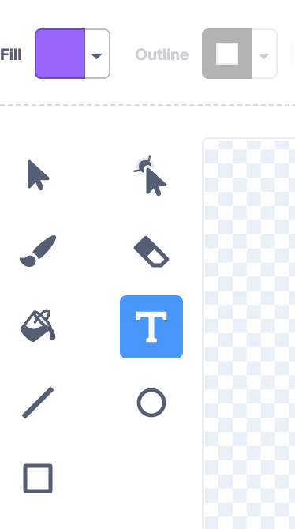
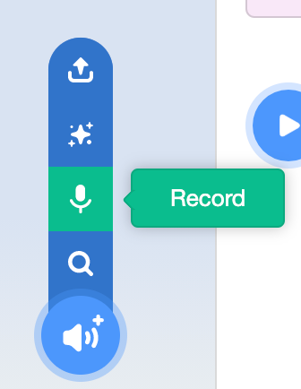

## Make
Now, you will make your digital card project. 

Start small, and add more to your project if you have time. 

--- task ---
If you have not already chosen a backdrop and added a sprite, then start now. You can always add more later, including using the Paint editor to make your own. 
--- /task ---

--- task ---

Think about **what** you want to say in your message in your digital card.

--- /task ---

--- task ---

Now, think about **how** you are going to say your message. You can either add your message as a **sprite/sprites** or a **sound**.
You can go to **Choose a Sprite** and select **Letters** from the Sprite Library or search for `numbers`:
{:width="150px"}

You could use the **Text** tool in the Paint editor to write a short message: 

--- collapse ---
---
title: Use the Text tool in the Paint editor
---

Select the first colour you want for your text:
{:width="150px"}

Select the **Text** tool:
{:width="150px"}

Click on the Paint editor and start typing.

Select the font you want by clicking on the drop-down menu:
{:width="300px"}

Click on the **Arrow** tool and select your text. Drag the corner handles to resize your text:
{:width="300px"}

Do you want to change the **Fill** colour? Select the **Fill (bucket)** tool and hover over your text - it will automatically change colour:
{:width="150px"}

If you want each word in your message to be a different colour, size, and font, then follow the process above for each word in your message.

Position your text and/or group of words with the **Arrow** tool at the centre of the Paint editor:
{:width="400px"}

To layer your words, use the **Forward** and **Backward** tools:
{:width="400px"}

--- /collapse ---

You can also use any other skill and tool from the Paint editor that you have learned:

+ [Paint editor](https://learning-admin.raspberrypi.org/en/projects/getting-started-scratch/6){:target="scratch_guide"}

--- /task ---

--- task ---
Do you need to add sounds to a **sprite** or to the **Stage**?

You can record a spoken message if you like:

--- collapse ---
---
title: Record a sound
---

Select the sprite that you want to add recorded sound to. Click on its **Sound** tab and select **Record**:
{:width="200px"}

To start recording, click the red circle button:
{:width="200px"}

To stop recording, click the red square button:
{:width="200px"}

You can now **re-record**, **play** the recording, and/or **save** your sound.

Name your sound:
{:width="300px"}

--- /collapse ---

--- /task ---

--- task ---

Now, think about how the user will interact with your project.

For example:
+ "When the user clicks on the green flag, a sprite moves"

+ "When the user clicks on a sprite, the sprite changes colour"

**Tip:** Write your initial idea down or tell a friend or family member. It's easier to make a project when you can explain what your idea is.

You might have lots of other ideas, save them for later.

--- /task ---

--- task ---
Add a block for **when** your sprite should do something.

--- collapse ---
---
title: Start code with Hat blocks
---

```blocks3
when green flag clicked
when this sprite clicked
```

These blocks have a different shape, they are sometimes called **Hat blocks** and they start code running when a particular event happens.
You could also use a `wait`{:class="block3control"} block to add a delay before running other blocks.
You may also need a `forever`{:class="block3control"} loop that keeps running blocks.

```blocks3
when green flag clicked
forever :: control
```
--- /collapse ---

--- /task ---

--- task ---

Add the blocks that you need to make your sprite do **what** you want it to do.

Here is some code to get you started. Just add what you need for your project.

```blocks3
when flag clicked
set size to (50)%
go to [back v] layer
set volume to (40)%
point in direction (90)
set rotation style [don't rotate v]
forever
move (2) steps
wait (0.1) seconds
next costume
if on edge, bounce

when this sprite clicked
change [color v] effect by (25)
play sound (Pop v) until done
```

You can use any of the skills that you have learned:

+ [Useful code](https://learning-admin.raspberrypi.org/en/projects/getting-started-scratch/4){:target="scratch_guide"}
+ [Block reference](https://learning-admin.raspberrypi.org/en/projects/getting-started-scratch/5){:target="scratch_guide"}

--- /task ---

**Tip:** Some of the best ideas come from playing. You will come across good ideas by accident.

--- task ---
Test your new code. Is it running as you imagined? 

**Debugging** is finding and fixing mistakes in your code which are called **bugs**.

--- collapse ---
---

title: Debugging tips

---

+ **My sprite is going upside down** — Add a `set rotation style [left-right v]`{:class="block3motion"} or `set rotation style [none v]`{:class="block3motion"} block.

+ **My sprite 'jumps' when it changes costume or bounces** — Make sure that the costume is centered in the Paint editor (line up the blue cross with the crosshair).

+ **My sprite stops when it gets to the edge of the Stage** — Add an `if on edge, bounce`{:class="block3motion"} block.

+ **My sound does not play** — Have you added a block to `play sound`{:class="block3sound"} when the sprite is clicked? If you have copied code from another sprite, you will need to add the sound to this sprite from the `Sounds`{:class="block3sound"} tab. Check the volume on your computer and make sure that you have not lowered the volume with code — try `set volume to (100)%`{:class="block3sound"}.

+ **Other sprites keep going in front of my sprite** — Use a `go to [front v] layer`{:class="block3looks"} block.

+ **My sprite only moves/changes once** — Put your code inside a `forever`{:class="block3control"} block so it keeps running.

+ **My sprite is not changing when I move a variable slider** — Put your code inside a `forever`{:class="block3control"} block so it keeps updating. 

--- /collapse ---

--- /task ---

--- task ---

Show someone else your project. Ask for their honest feedback. Can you make improvements?

--- /task ---

**Tip:** It's ok to change your mind, but always be clear about what you are aiming for.

--- task ---
What is your next step? It might be to add more code to your sprite. It might be to add code to another sprite. It might be to record a sound or paint a new costume. 

Are you stuck for ideas? Don't forget to look at step 3: [Investigate](https://learning-admin.raspberrypi.org/en/projects/digital-card/2){:target=”_blank”} and **See inside** some projects.

If you have finished or don't have much time left, then move on to the next step to share your digital card.

--- /task ---

--- save ---
